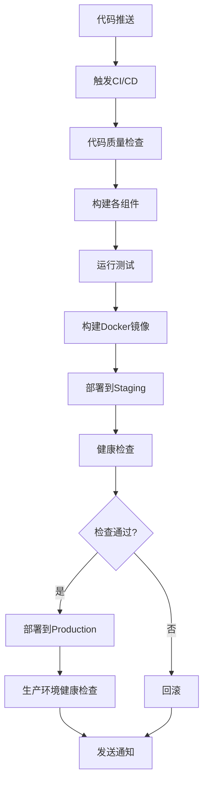

# DevOps 自动化部署指南

本文档详细介绍了如何设置和使用项目的DevOps自动化构建和部署系统。

## 📋 目录

- [系统架构](#系统架构)
- [快速开始](#快速开始)
- [组件说明](#组件说明)
- [部署流程](#部署流程)
- [定时任务](#定时任务)
- [监控和日志](#监控和日志)
- [故障排除](#故障排除)
- [最佳实践](#最佳实践)

## 🏗️ 系统架构

```
┌─────────────────────────────────────────────────────────────┐
│                     DevOps 自动化系统                        │
├─────────────────────────────────────────────────────────────┤
│  Git Repository (代码仓库)                                   │
│  ├── 微信小程序 (pages/, app.js, app.json)                   │
│  ├── Java应用 (java-mac-app/)                               │
│  └── Python工具 (excel_transpose.py, requirements.txt)      │
├─────────────────────────────────────────────────────────────┤
│  CI/CD 流水线                                               │
│  ├── GitHub Actions (.github/workflows/ci-cd.yml)          │
│  ├── GitLab CI/CD (.gitlab-ci.yml)                         │
│  └── 本地定时任务 (cron)                                     │
├─────────────────────────────────────────────────────────────┤
│  构建系统                                                   │
│  ├── 构建脚本 (scripts/build-all.sh)                        │
│  ├── Docker镜像 (Dockerfile, docker-compose.yml)           │
│  └── 构建产物 (build/*.tar.gz)                              │
├─────────────────────────────────────────────────────────────┤
│  部署系统                                                   │
│  ├── 部署脚本 (scripts/deploy.sh)                           │
│  ├── 服务更新 (scripts/update-service.sh)                   │
│  └── 健康检查 (scripts/health-check.sh)                     │
├─────────────────────────────────────────────────────────────┤
│  监控系统                                                   │
│  ├── 系统监控 (Prometheus)                                  │
│  ├── 日志收集 (Fluent Bit)                                  │
│  ├── 健康检查 (定时任务)                                     │
│  └── 报告生成 (scripts/generate-report.sh)                  │
└─────────────────────────────────────────────────────────────┘
```

## 🚀 快速开始

### 1. 环境准备

确保系统已安装以下软件：

```bash
# 基础工具
sudo apt update
sudo apt install -y git curl wget tar rsync cron

# Java环境 (Java 21)
sudo apt install -y openjdk-21-jdk maven

# Python环境
sudo apt install -y python3 python3-pip python3-venv

# Docker环境
curl -fsSL https://get.docker.com -o get-docker.sh
sudo sh get-docker.sh
sudo usermod -aG docker $USER

# Docker Compose
sudo curl -L "https://github.com/docker/compose/releases/latest/download/docker-compose-$(uname -s)-$(uname -m)" -o /usr/local/bin/docker-compose
sudo chmod +x /usr/local/bin/docker-compose
```

### 2. 项目初始化

```bash
# 克隆项目
git clone <your-repo-url>
cd <project-directory>

# 给脚本添加执行权限
chmod +x scripts/*.sh

# 设置定时任务
./scripts/setup-cron.sh
```

### 3. 首次构建

```bash
# 执行完整构建
./scripts/build-all.sh

# 检查构建产物
ls -la build/
```

### 4. 首次部署

```bash
# 执行部署
./scripts/deploy.sh

# 检查服务状态
./scripts/health-check.sh
```

## 🔧 组件说明

### 构建脚本

| 脚本文件 | 功能描述 |
|----------|----------|
| `scripts/build-all.sh` | 完整构建所有组件 |
| `scripts/deploy.sh` | 部署应用到目标环境 |
| `scripts/update-service.sh` | 从Git拉取代码并更新服务 |
| `scripts/health-check.sh` | 健康检查和状态监控 |
| `scripts/generate-report.sh` | 生成日报和状态报告 |
| `scripts/setup-cron.sh` | 设置定时任务 |

### Docker配置

| 文件 | 功能描述 |
|------|----------|
| `Dockerfile` | 多阶段构建镜像 |
| `docker-compose.yml` | 完整服务编排 |
| `docker/supervisord.conf` | 进程管理配置 |
| `docker/crontab` | 容器内定时任务 |

### CI/CD配置

| 文件 | 功能描述 |
|------|----------|
| `.github/workflows/ci-cd.yml` | GitHub Actions流水线 |
| `.gitlab-ci.yml` | GitLab CI/CD流水线 |

## 📅 部署流程

### 自动化流程



### 手动部署

```bash
# 1. 拉取最新代码
git pull origin main

# 2. 构建项目
./scripts/build-all.sh

# 3. 部署应用
./scripts/deploy.sh

# 4. 验证部署
./scripts/health-check.sh
```

## ⏰ 定时任务

系统配置了以下定时任务：

```bash
# 每天凌晨2:00 - 完整更新
0 2 * * * /path/to/project/scripts/update-service.sh

# 每天凌晨2:30 - 独立部署
30 2 * * * /path/to/project/scripts/deploy.sh

# 每小时 - 健康检查
0 * * * * /path/to/project/scripts/health-check.sh

# 每6小时 - 检查代码更新
0 */6 * * * cd /path/to/project && git fetch origin

# 每天凌晨4:00 - 清理旧日志
0 4 * * * find /path/to/logs -name "*.log" -mtime +7 -delete

# 每周日凌晨3:00 - 清理旧构建产物
0 3 * * 0 find /path/to/build -name "*.tar.gz" -mtime +30 -delete

# 每天凌晨5:00 - 生成日报
0 5 * * * /path/to/project/scripts/generate-report.sh
```

### 修改定时任务

```bash
# 编辑定时任务
crontab -e

# 查看当前任务
crontab -l

# 重新设置任务
./scripts/setup-cron.sh
```

## 📊 监控和日志

### 日志位置

```
logs/
├── build.log          # 构建日志
├── deploy.log         # 部署日志
├── health.log         # 健康检查日志
├── update.log         # 更新日志
├── git-check.log      # Git检查日志
└── report.log         # 报告生成日志
```

### 监控端点

| 端点 | 功能 |
|------|------|
| `http://localhost:8080/health` | 应用健康检查 |
| `http://localhost:9090` | Prometheus监控 |
| `http://localhost:80` | Web管理界面 |

### 查看日志

```bash
# 查看最新构建日志
tail -f logs/build.log

# 查看部署状态
tail -f logs/deploy.log

# 查看健康检查
tail -f logs/health.log

# 查看系统资源
docker stats

# 查看服务状态
docker-compose ps
```

## 🔍 故障排除

### 常见问题

#### 1. 构建失败

```bash
# 检查构建日志
cat logs/build.log

# 检查依赖
java -version
python3 --version
mvn --version

# 手动构建测试
cd java-mac-app
mvn clean compile
```

#### 2. 部署失败

```bash
# 检查部署日志
cat logs/deploy.log

# 检查服务状态
systemctl status app-service
docker-compose ps

# 检查端口占用
netstat -tuln | grep 8080
```

#### 3. 健康检查失败

```bash
# 手动健康检查
curl -f http://localhost:8080/health

# 检查服务日志
docker-compose logs

# 检查系统资源
df -h
free -h
top
```

#### 4. 定时任务不执行

```bash
# 检查cron服务
systemctl status cron

# 检查定时任务
crontab -l

# 查看cron日志
tail -f /var/log/cron.log

# 手动执行脚本测试
./scripts/update-service.sh
```

### 回滚操作

```bash
# 查看备份
ls -la /opt/app/backups/

# 手动回滚
BACKUP_FILE="/opt/app/backups/backup_20240101_120000.tar.gz"
sudo systemctl stop app-service
sudo rm -rf /opt/app/current
sudo tar -xzf $BACKUP_FILE -C /opt/app/
sudo systemctl start app-service
```

## 🎯 最佳实践

### 1. 代码管理

- 使用Git Flow工作流
- 所有更改通过Pull Request
- 保持commit信息清晰
- 定期清理分支

### 2. 构建优化

- 使用构建缓存加速
- 并行构建不同组件
- 定期清理构建产物
- 监控构建时间

### 3. 部署策略

- 使用蓝绿部署或滚动更新
- 部署前充分测试
- 保持回滚能力
- 监控部署过程

### 4. 监控告警

- 设置关键指标监控
- 配置告警通知
- 定期检查日志
- 建立故障响应流程

### 5. 安全考虑

- 定期更新依赖
- 使用密钥管理
- 限制访问权限
- 定期安全扫描

## 📞 联系支持

如有问题，请通过以下方式联系：

- **项目维护者**: DevOps团队
- **文档位置**: `/workspace/DEVOPS_README.md`
- **脚本位置**: `/workspace/scripts/`
- **配置位置**: `/workspace/docker/`, `/workspace/.github/`, `/workspace/.gitlab-ci.yml`

---

*最后更新时间: $(date)*
*文档版本: v1.0*